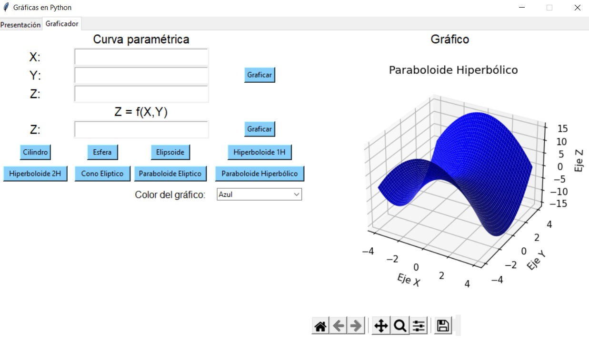

# Vectorial-Graphics
Vectorial Graphics with Python UI

This repository provides a 3D vector surface plotter, where the user has the option of entering the equation as a function of Z or as a parametric curve.

In addition there are also predefined curves that can be selected to view their graph. And as an extra you can change the color of the surfaces.

